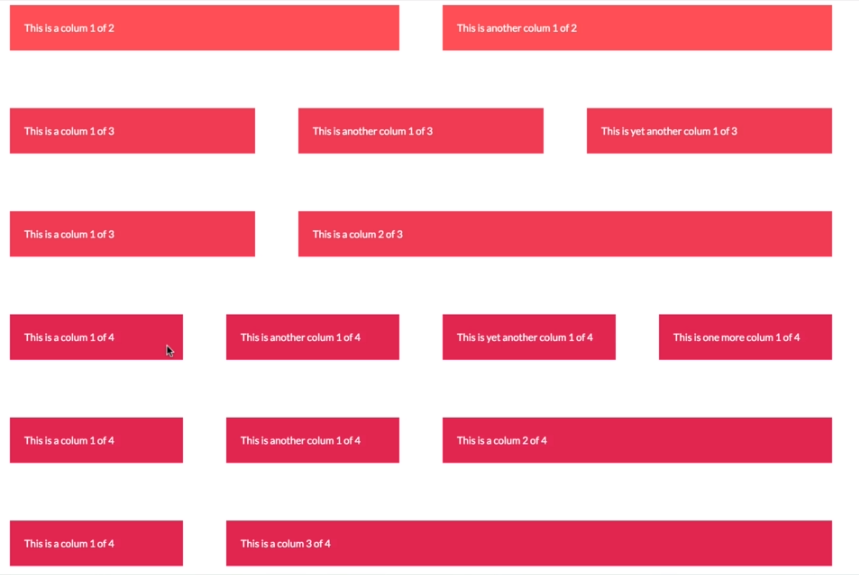

# Advanced CSS Course from Jonas Schedmann

Jonas has a lot of  resources on his [Internet page](http://codingheroes.io/resources/) 

## 3 Pillars to write good HTML and CSS
1. **Responsive Design:**
Fluid layouts, media queries, responsive images, correct units, dektop vs mobile first
2. **Maintainable and scalable code:**
clean, easy-to-understand, growth, reusable, how to organize files, how to name classes, how to structure html
3. **Web Performanc:**
less http request, less code, compressed code, css preprocessor, less images, compress images

## CSS Architecture:
The process: 
1. Think
2. Build
3. Architect

### Think
Think of your website as a colection of components (Component driven design). The components are modular building blocks, that are re-usable, independent and are held together by the layout of the page.

### Build (BEM Method)
* **Block**: standalone component that is meaningful on its own
* **Element**: part of a block that has no standalone meaning
* **Modifier**: a different version of a block or an element

```css
.block {}
.block__element {}
.block__element--modifier {}
```
There are a lot of other Build Methods, like OOCSS, DRY CSS, SMACSS. 

### Architecting with files and folders
**The 7-1 Pattern**: 7 folders for partial sass files, 1 main sass file to import all others

The 7 folders
* base/
* components/
* layout/
* pages/
* themes/
* abstracts/
* vendors/

*You don't have to use allways all folders, it depents on de size and scope of the proyect*

## Introduction to SASS and NPM

### NPM
is a simple command line interface. Helps you install and manage packages, like tools, libraries, frameworks and more.

*Depends on Node.js, so install it first. Check:* `node -v`

Then install NPM

In a proyect, when using NPM, the first step is create a `package.json` file. Command `npm init` and follow the steps

To install sass for example `npm install node-sass --save-dev` 
* `--save-prod` --> "dependencies": These packages are **required** by your application in production.
* `--save-dev` --> "devDependencies": These packages are only needed for **development and testing**.

To uninstall a package 
* `npm unintall <package name> [install flag]`

[More info about NPM and package.json](https://docs.npmjs.com/getting-started/using-a-package.json)

#### Write NPM Scrits
on `package.json` under "scripts" you can write you're npm scripts. 

* **Sass npm script:** `"node-sass <sass dir>/main.scss <css dir>/style.css"`
* **To use the script:** `npm run <script name>`

## Basic responsive design principles
1. **Fluid Grids and layouts:** to allow content to adapt to the currrent viewport width. Use `%` rather than `px`.
* Float Layout
* Flexbox
* CSS Grid
2. **Flexible/Responsive Images:** we need to ensure that they adapt also nicely to the viewport
3. **Media Queries:** changes styles depending on the viewport width (breakpoints), allowing us to create different versions of our website for different widths. 

## Grid system and layouts
### Float Layout


#### HTML
```html
<div class="row">
  <div class="col-1-of-2">
    Col 1 of 2
  </div>
</div>
```

#### SCSS
```scss
.row {
  width: 90%;
  margin: 0 auto;
  
  &:not(:last-child) {
    margin-bottom: $gutter-vertical; //creates bottom space in every row except the last one
  }
  
  //clear fix hack on .row
  &::after {
    content: "";
    display: table;
    clear: both;
    }
}

.col-1-of-2 {
  width: calc((100% - #{$gutter-horizontal}) / 2);
  float: left;
  
  &:not(:last-child){
    margin-rigth: $gutter-horizontal;
    }
}
``` 
