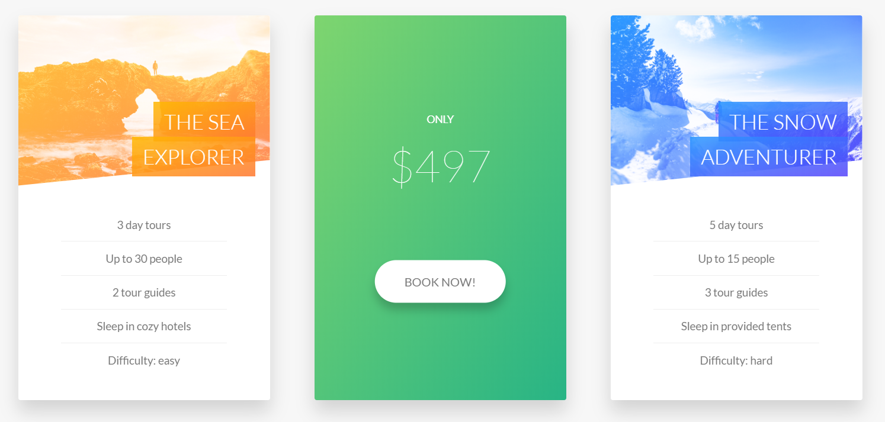
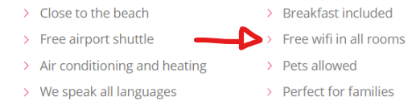

# CSS Components

## Table of content

- [CSS Components](#css-components)
    - [Table of content](#table-of-content)
    - [Checkbox Hack](#checkbox-hack)
    - [Rotating Cards](#rotating-cards)
    - [Background Video](#background-video)
    - [Popup](#popup)
    - [color-gradient over text](#color-gradient-over-text)

## Checkbox Hack

The HTML
```html
<div class="toggler">
    <!-- The input is the checkbox -->
    <input type="checkbox" class="checkbox" id="toggle">

    <!-- The Label, when clicked enables a toggle functionality -->
    <label for="toggle" class="button">
        <span class="icon">&nbsp;</span>
    </label>

    <div class="something">&nbsp;</div>
</div>
```

SCSS
```scss
.toggler {
    .checkbox {
        display: none; //makes the Checkbox disappear
    }

    .button {
        // button styles
        // button location
        cursor: pointer;
    }

    //FUNCTIONALITY
    .checkbox:checked ~ .something {
        // some styles
    }
}
```

---

## Rotating Cards



HMTL

```html

<div class="card">
    <!-- FRONT -->
    <div class="card__side card__side--front">
        <div class="card__picture card__picture--1">
            &nbsp;
        </div>
        <h4 class="card__heading">
            <span class="card__heading-span card__heading-span--1">Title</span>
        </h4>
        <div class="card__details">
            <ul>
                <li>Something</li>
            </ul>
        </div>
    </div>
    <!-- BACK -->
    <div class="card__side card__side--back">
        <div class="card__content">
            Some content
        </div>
    </div>
</div>
```

SCSS

```scss

.card {
    // FUNCTIONALITY
    perspective: 150rem;
    -moz-perspective: 150rem;
    position: relative;
    height: $card-height;

    &__side {
        height: $card-height;
        transition: all .8s ease;
        position: absolute;
        top: 0;
        left: 0;
        width: 100%;
        backface-visibility: hidden;

        &--front {
            background-color: $color-white;
        }

        &--back {
            transform: rotateY(180deg);
        }
    }
  
    &:hover &__side--front {
        transform: rotateY(-180deg);
    }

    &:hover &__side--back {
        transform: rotateY(0);
    }
}
// Styles
```

---

## Background Video

HTML

```html
<section class="section-stories">
    <div class="bg-video">
        <video class="bg-video__content" autoplay muted loop>
            <source src="img/video.mp4" type="video/mp4">
            <source src="img/video.webm" type="video/webm">
            Your browser is not supported!
        </video>
    </div>

    <!-- some content -->

</section>
```

SCSS
```scss
// Does not work in every browser
.bg-video {
    position: absolute;
    top: 0;
    left: 0;
    height: 100%;
    width: 100%;
    z-index: -1;
    opacity: .15;
    overflow: hidden;

    &__content {
        height: 100%;
        width: 100%;
        object-fit: cover;
    }
}
```

---

## Popup

HTML

```html
<!-- activator -->
<a href="#popup" class="btn">Activate popup!</a>

<div class="popup" id="popup">
    <div class="popup__content">
        Some Content
    </div>
</div>
```

SCSS

```scss
.popup {
    // creates a black semi-transparend background
    height: 100vh;
    width: 100%;
    position: fixed;
    top: 0;
    left: 0;
    background-color: rgba($color-black, .8);
    z-index: 9999;
    opacity: 0;
    visibility: hidden;
    transition: all .3s;

    &__content {
        // content styles
    }

    //Functionality
    &:target { //when <a href="#popup"> is clicked
        opacity: 1;
        visibility: visible;
    }

    &:target &__content {
        opacity: 1;
        transform: translate(-50%, -50%) scale(1);
    }
}
```

---

## color-gradient over text


HTML
```html
<h2 class="heading">
    Hello World
</h2>
```

SCSS

```scss

.heading {
    // styles

    display: inline-block;
    background-image: linear-gradient(to right, $color-primary, $color-secondary);
    -webkit-background-clip: text;
    color: transparent;
}
```

Using SVG as Icons in CSS



There are to Options

```scss

.item::before{
    content: "";
    display: inline-block;
    height: 1rem;
    width: 1rem;

    // Option 1 // Older Browsers
    background-image: url(path/image.png);
    background-size: cover;

    // To use both use @support like this
    @support (-webkit-mask-image: url()) or (mask-image: url()){
        // Option 2 // Less Support - Enables you to change color of svg
        background-color: $color;
        -webkit-mask-image: url(path/image.png);
        -webkit-mask-size: cover;
        mask-image: url(path/image.png);
        mask-size: cover;
        // So you can use both
        background-image: none;
    }
}
```