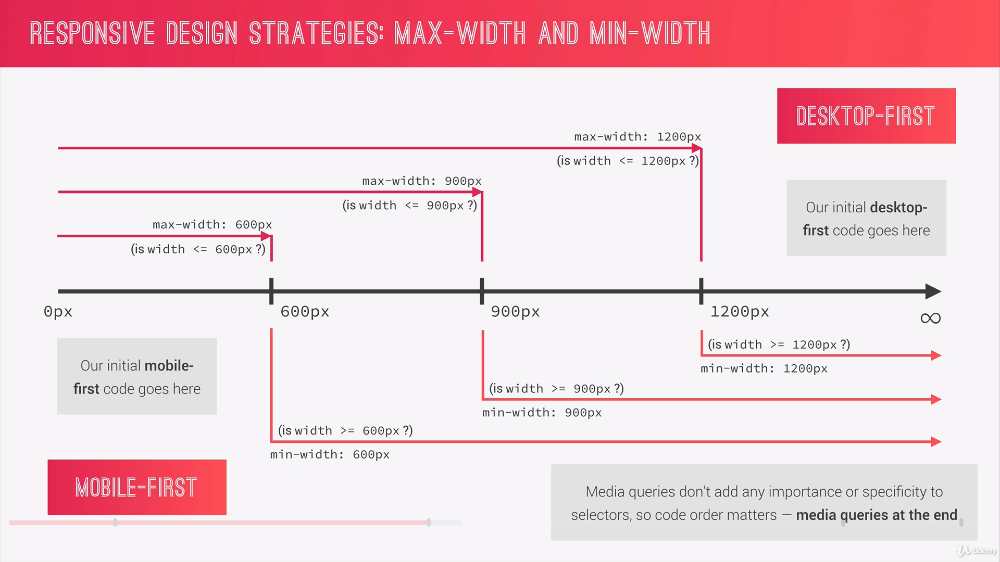
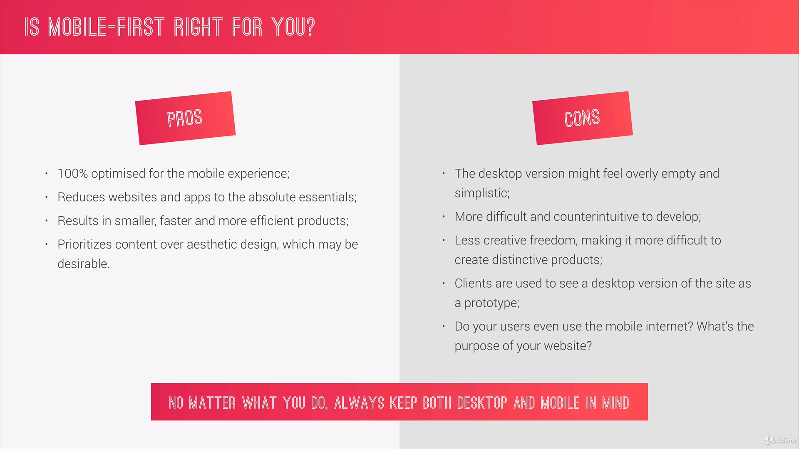

# Basic responsive design principles
1. **Fluid Grids and layouts:** to allow content to adapt to the current viewport width. Use `%` rather than `px`.
* Float Layout
* Flexbox
* CSS Grid
2. **Flexible/Responsive Images:** we need to ensure that they adapt also nicely to the viewport
3. **Media Queries:** changes styles depending on the viewport width (breakpoints), allowing us to create different versions of our website for different widths. 

## Grid system and layouts
### Float Layout


#### HTML
```html
<div class="row">
  <div class="col-1-of-2">
    Col 1 of 2
  </div>
</div>
```

#### SCSS
```scss
.row {
  width: 90%;
  margin: 0 auto;
  
  &:not(:last-child) {
    margin-bottom: $gutter-vertical; //creates bottom space in every row except the last one
  }
  
  //clear fix hack on .row
  &::after {
    content: "";
    display: table;
    clear: both;
    }
}

.col-1-of-2 {
  width: calc((100% - #{$gutter-horizontal}) / 2);
  float: left;
  
  &:not(:last-child){
    margin-rigth: $gutter-horizontal;
    }
}
```
## Mobile first vs Desktop first

### Desktop First
* Is optimized for large screens
* `max-width(...)`

### Mobile First 

* Optimized for mobiles
* `min-width(...)`

## Breakpoints

**Good:** you see which are the most used device width and make your decision from there

**Perfect:** you start from your mobile or desktop page and start decreasing your browser and every time your design brakes, you add a Media Query. 

## How to use Media Queries

### Use Mixins

**Desktop First**
```scss
@mixin md-down($breakpoint) {
    @if $breakpoint == phone {
        @media only screen and (max-width: 37.5em) { @content };    //600px
    }
    @if $breakpoint == tab-port {
        @media only screen and (max-width: 56.25em) { @content };     //900px
    }
    @if $breakpoint == tab-land {
        @media only screen and (max-width: 75em) { @content };    //1200px
    }
}
```
**Mobile First**
```scss
@mixin mq-up($breakpoint) {
    @if $breakpoint == phone {
        @media only screen and (min-width: 37.5em) { @content };    //600px
    }
    @if $breakpoint == tab-port {
        @media only screen and (min-width: 56.25em) { @content };     //900px
    }
    @if $breakpoint == tab-land {
        @media only screen and (min-width: 75em) { @content };    //1200px
    }
}
```

And add the mixins at the end of your styles. Examples: 
```scss
.row {
    // styles
    &:not(:last-child) {
        // styles

        @include respond(tab-port) {
            // media queries styles
        }
    }
    @include respond(tab-port) {
        // media queries styles
    }
    [class^="col-"] {    
        &:not(:last-child) {
            // styles

            @include respond(tab-port) {
                // media queries styles
            }
        }
    }
```
