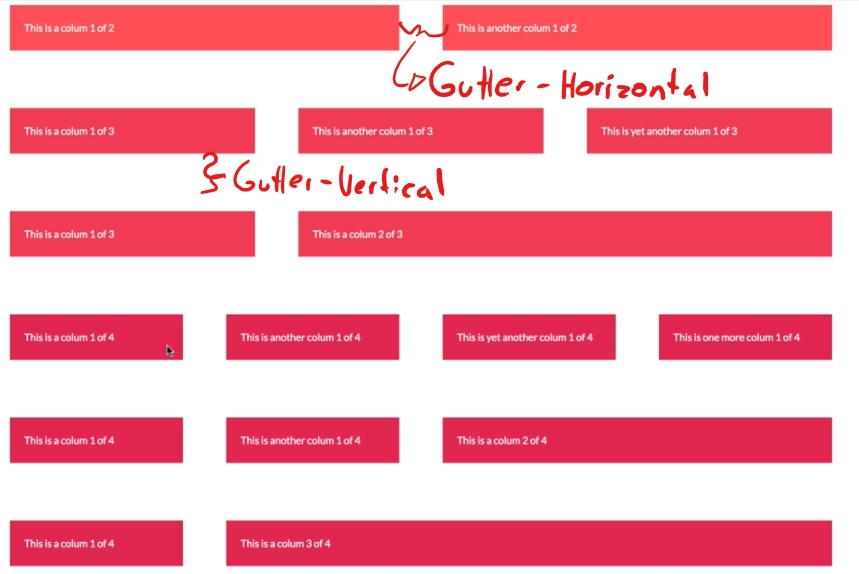
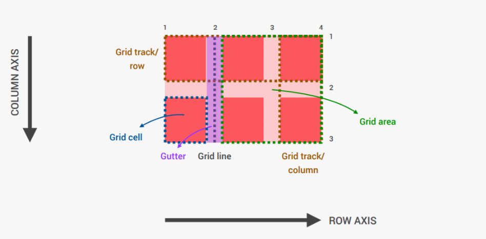

# Grid system and layouts

1. **Fluid Grids and layouts:** to allow content to adapt to the current viewport width. Use `%` rather than `px`.
* Float Layout
* Flexbox
* CSS Grid
2. **Flexible/Responsive Images:** we need to ensure that they adapt also nicely to the viewport
3. **Media Queries:** changes styles depending on the viewport width (breakpoints), allowing us to create different versions of our website for different widths. 

## Float Layout


### HTML
```html
<div class="row">
  <div class="col-1-of-2">
    Col 1 of 2
  </div>
</div>
```

### SCSS
```scss
.row {
  width: 90%;
  margin: 0 auto;
  
  &:not(:last-child) {
    margin-bottom: $gutter-vertical; //creates bottom space in every row except the last one
  }
  
  //clear fix hack on .row
  &::after {
    content: "";
    display: table;
    clear: both;
    }
}

.col-1-of-2 {
  width: calc((100% - #{$gutter-horizontal}) / 2);
  float: left;
  
  &:not(:last-child){
    margin-rigth: $gutter-horizontal;
    }
}
```

## Flex Box

See also: [A Complete Guide to Flexbox
](https://css-tricks.com/snippets/css/a-guide-to-flexbox/)


## CSS Grid

See also: [A Complete Guide to Grid](https://css-tricks.com/snippets/css/complete-guide-grid/)

### Basic Grid Terminology


### What are grid tracks



### Posible properties for Grid


### How to use justify and align


### CSS Grid Tricks

How to write responsive grid colums

```scss

.grid-container {
  display: grid;
  grid-template-columns: repeat(auto-fit, minmax(25rem, 1fr));
  // auto-fit: creates as much colums as the content needs
  // minmax( 25rem --> is the minimum witdh a column can get
  // ,1fr) --> uses all the space it has
}
```

Allways give your colums names 

```scss

.container {
    display: grid;
    grid-template-rows: 80vh min-content 40vw repeat(3, min-content);
    grid-template-columns: 
        [sidebar-start] 8rem 
        [sidebar-end full-start] minmax(6rem, 1fr)
        [center-start] repeat(8, [col-start] minmax(min-content, 14rem) [col-end])
        [center-end] minmax(6rem, 1fr) [full-end];

  // so that you can use them later like this, this makes it easier to later change the grid with meadia queries. If you define your items with numbers, inseat of names it will be a lot of work.
}

.grid-item{
  grid-column: full-start / col-end 4;
}
```

how to select colums inside repeat() function

```scss
.row {
  grid-template-colums: repeat(8, [col-start] 1fr [col-end]);
}

.item {
  grid-column: col-start 1 / col-end 4; // put the number behind 
}
```