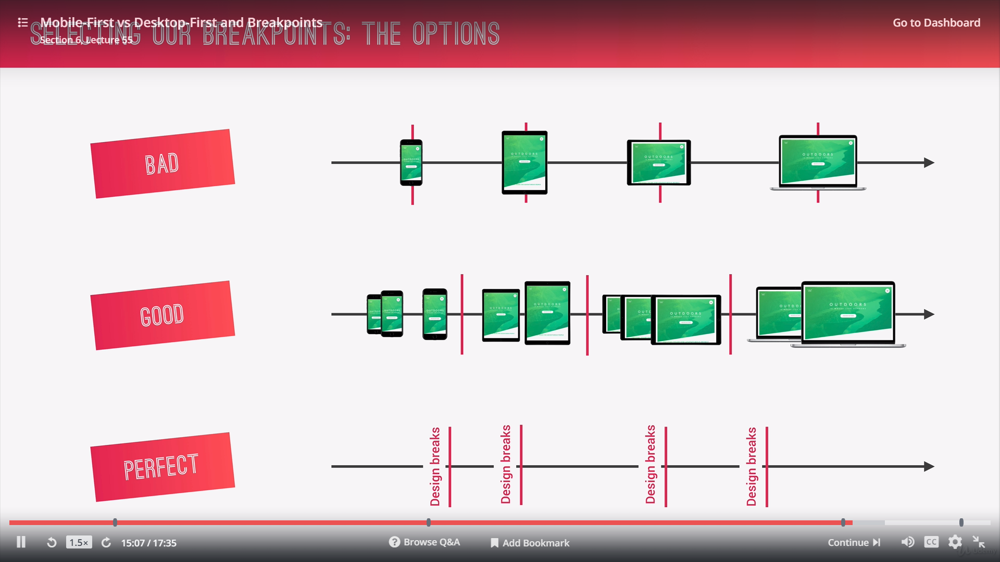

# Basic responsive design principles

## Using rem instead of pixel

Using `rem` makes you site more responsive and accesible for people. If the users changes the default `font-size` in his browser, it still will work perfectly.

```scss

html {
    // This defines what 1rem is
    font-size: 62.5%; //1 rem = 10px; 10px/16px = 62.5%

    // then you can use media querias and change the value

    body {
        box-sizing: border-box;
        padding: 3rem; //represents 30 pixel
    }
}
```

Note that when using `media queries` it is best to use `em` instead.

## Mobile first vs Desktop first


### Desktop First

* Is optimized for large screens
* `max-width(...)`

### Mobile First 


* Optimized for mobiles
* `min-width(...)`

## Breakpoints


**Good:** you see which are the most used device width and make your decision from there

**Perfect:** you start from your mobile or desktop page and start decreasing your browser and every time your design brakes, you add a Media Query. 

## How to use Media Queries

### Use Mixins

#### For Desktop First

```scss
@mixin md-down($breakpoint) {
    @if $breakpoint == phone {
        @media only screen and (max-width: 37.5em) { @content };    //600px
    }
    @if $breakpoint == tab-port {
        @media only screen and (max-width: 56.25em) { @content };     //900px
    }
    @if $breakpoint == tab-land {
        @media only screen and (max-width: 75em) { @content };    //1200px
    }
}
```

#### For Mobile First

```scss

@mixin mq-up($breakpoint) {
    @if $breakpoint == phone {
        @media only screen and (min-width: 37.5em) { @content };    //600px
    }
    @if $breakpoint == tab-port {
        @media only screen and (min-width: 56.25em) { @content };     //900px
    }
    @if $breakpoint == tab-land {
        @media only screen and (min-width: 75em) { @content };    //1200px
    }
}
```

And add the mixins at the end of your styles. Examples:

```scss

.row {
    // styles
    &:not(:last-child) {
        // styles

        @include respond(tab-port) {
            // media queries styles
        }
    }
    @include respond(tab-port) {
        // media queries styles
    }
    [class^="col-"] {    
        &:not(:last-child) {
            // styles

            @include respond(tab-port) {
                // media queries styles
            }
        }
    }
```

## Browser support

Test always for browser support with [caniuse.com](https://caniuse.com/)

To apply certain styles if the browser supports the property use this method: `@supports (property: value){...}`

example

```scss
div {
    @supports (display: grid) {
        display: grid;
  }
}
```

More information on [MDN](https://developer.mozilla.org/en-US/docs/Web/CSS/@supports)